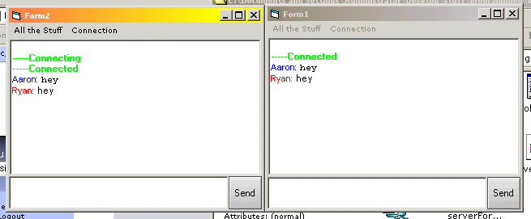



## a 2 computer instant messenger

### Description

this is a chat program between two computers to test it on your computer put your IP in the form_load of the client's form1. its not very customizeable and doesn't have many features but if you are a beginner you could learn about winsock from it. if this helps you please leave comments.
 
### More Info
 

             |
---                |---
**Submitted On**   |2002-12-01 22:47:36
**By**             |[RyanOlson](https://github.com/Planet-Source-Code/PSCIndex/blob/master/ByAuthor/ryanolson.md)
**Level**          |Beginner
**User Rating**    |4.4 (57 globes from 13 users)
**Compatibility**  |VB 6\.0
**Category**       |[Internet/ HTML](https://github.com/Planet-Source-Code/PSCIndex/blob/master/ByCategory/internet-html__1-34.md)
**World**          |[Visual Basic](https://github.com/Planet-Source-Code/PSCIndex/blob/master/ByWorld/visual-basic.md)
**Archive File**   |[a\_2\_comput1506401212002\.zip](https://github.com/Planet-Source-Code/ryanolson-a-2-computer-instant-messenger__1-41217/archive/master.zip)

